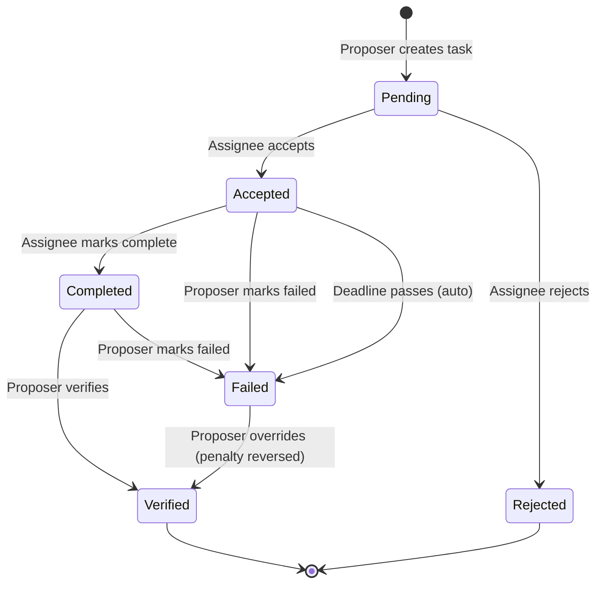

# The Ledger — Couples Accountability App

A two-person accountability app where partners propose tasks to each other with financial penalties for non-completion. Built on Cloudflare Workers.

## How It Works

1. Either person proposes a task with a deadline and dollar penalty
2. The other person accepts or rejects
3. The assignee completes the task and marks it done
4. The proposer verifies completion
5. If the task fails or the deadline passes, the penalty is recorded in the ledger

## Task Lifecycle



## Actions by Role

### Proposer (person who created the task)

| Task Status | Available Actions | What Happens |
|---|---|---|
| **Pending** | — | Waiting for partner to accept or reject |
| **Accepted** | Mark Failed | Applies the penalty to the ledger |
| **Completed** | Verify Completion | Task is done, no penalty |
| **Completed** | Mark Failed | Rejects the completion claim, applies penalty |
| **Failed** | Override — They Did It | Reverses the penalty, marks as verified |
| **Verified** | — | Terminal state |
| **Rejected** | — | Terminal state |

### Assignee (person the task is assigned to)

| Task Status | Available Actions | What Happens |
|---|---|---|
| **Pending** | Accept | Commits to the task and deadline |
| **Pending** | Reject | Declines the task, no penalty |
| **Accepted** | Mark Complete | Claims the task is done, sends to proposer for verification |
| **Completed** | — | Waiting for proposer to verify |
| **Failed** | — | Terminal state |
| **Verified** | — | Terminal state |
| **Rejected** | — | Terminal state |

### Automatic

| Condition | What Happens |
|---|---|
| Accepted task passes its deadline | Auto-fails on next dashboard load, penalty applied |

## The Ledger

The ledger tracks a running balance between the two users. Entries are created when:

- A task **fails** (manual or deadline): assignee owes proposer the penalty amount
- A failure is **overridden**: proposer pays back the penalty (reversal entry)

The balance shows on the dashboard and on the dedicated Ledger page.

## Tech Stack

- **Runtime**: Cloudflare Workers
- **Framework**: Hono
- **Database**: Cloudflare D1 (SQLite)
- **Auth**: Email + password (PBKDF2 via Web Crypto), JWT sessions
- **Email**: Resend API for notifications
- **Frontend**: Vanilla HTML/CSS/JS (single-page app with hash routing)

## Local Development

```bash
# Install dependencies
npm install

# Initialize the local database
npm run init-db:local

# Start the dev server
npm run dev
# Open http://localhost:8787
```

Register two accounts (max 2 allowed), then start proposing tasks to each other.

## Deploy

```bash
# Create the D1 database
wrangler d1 create accountability-app
# Update database_id in wrangler.toml with the returned ID

# Set production secrets
wrangler secret put JWT_SECRET
wrangler secret put RESEND_API_KEY

# Initialize remote database
npm run init-db

# Deploy
npm run deploy
```

## Project Structure

```
src/                    Backend (TypeScript)
  index.ts              Hono app entry point
  types.ts              Interfaces and types
  routes/
    auth.ts             Register, login, me
    proposals.ts        CRUD + state transitions
    ledger.ts           Transaction history + balance
  middleware/
    auth.ts             JWT verification
  db/
    users.ts            User queries
    proposals.ts        Proposal queries
    ledger.ts           Ledger queries
  auth/
    password.ts         PBKDF2 hash/verify
    jwt.ts              JWT sign/verify
  services/
    email.ts            Resend notifications

public/                 Frontend (vanilla JS)
  index.html            SPA shell
  style.css             Vintage ledger theme
  app.js                Router + API client
  views/
    login.js            Login/register
    dashboard.js        Active tasks + balance
    create-proposal.js  New proposal form
    proposal-detail.js  Detail + action buttons
    ledger.js           Transaction history table
```
